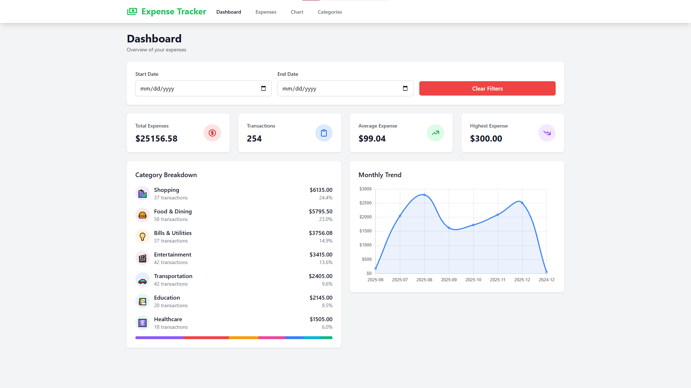
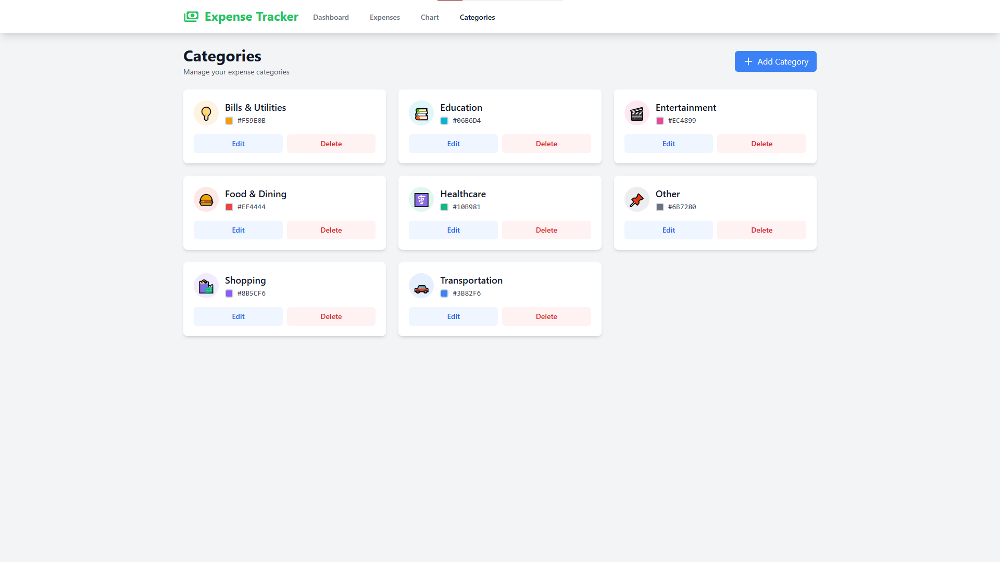
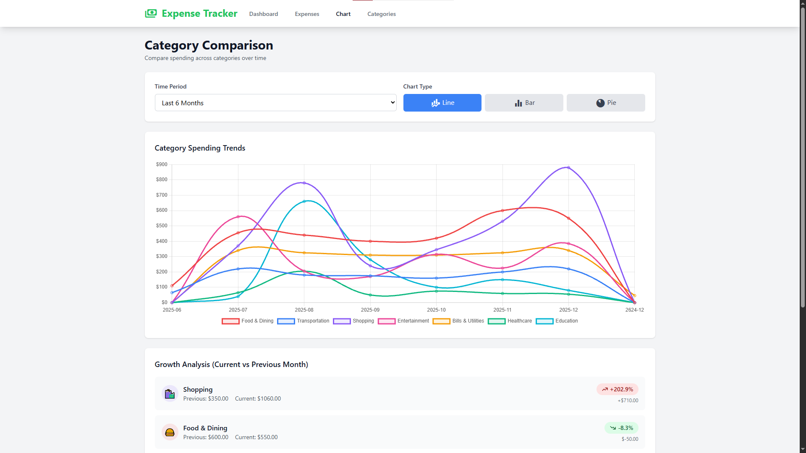
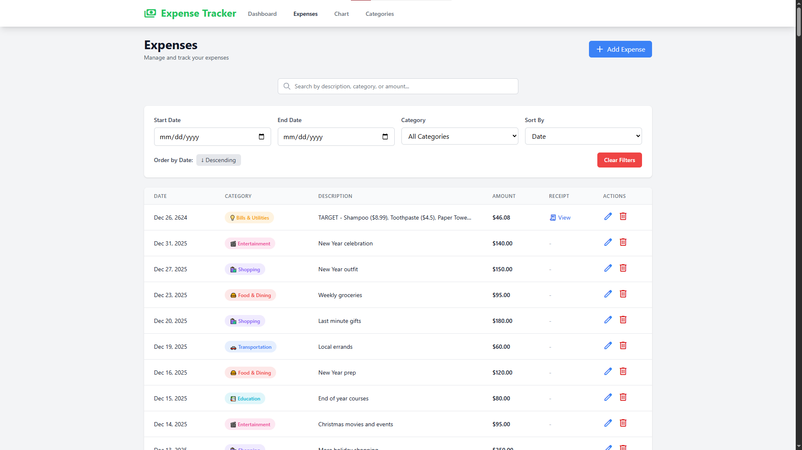

# Expense Tracker

A sophisticated full-stack expense management system featuring **AI-powered Receipt OCR**, dynamic analytics, and a seamless responsive UI. Built with the MEVN stack (MySQL, Express, Vue, Node).


---

## 🚀 Tech Stack

| Frontend | Backend | DevOps/DB |
| :--- | :--- | :--- |
| **Vue 3** (Composition API) | **Node.js** | **MySQL 8.0** |
| **Tailwind CSS** | **Express.js** | **Docker & Compose** |
| **Chart.js** | **Multer** (File Uploads) | **Nginx** |
| **Tesseract.js** (OCR) | **Axios** | **REST API** |

---

## ✨ Key Features

### 📸 Smart Receipt OCR
- **Automatic Data Extraction** - Scan receipts using **Tesseract.js** to auto-fill amount, date, and merchant.
- **Client-Side Processing** - OCR happens in the browser to ensure speed and privacy.
- **Image Linking** - Receipts are stored on the server and linked directly to your expense records.

### 📊 Advanced Analytics
- **Real-time Dashboard** - Instant summary of total spending and transaction counts.
- **Visual Trends** - Line, bar, and pie charts powered by **Chart.js**.
- **Comparative Analysis** - Multi-month spending comparison and growth tracking (% MoM).

### 🏷️ Management & UX
- **Custom Categories** - Create categories with unique colors and emoji icons.
- **Powerful Filtering** - Search and filter by date range, category, or keywords.
- **Fully Responsive** - Optimized for Desktop, Tablet, and Mobile devices.
- **Dockerized** - Ready for deployment with Docker Compose.

---

### 📊 Dashboard & Analytics
- **Real-time Summary** - Total expenses, monthly spending, transaction count
- **Category Breakdown** - Visual pie chart of spending by category
- **Monthly Trends** - Line chart showing spending patterns over time
- **Category Comparison** - Multi-month analysis with line, bar, and pie charts
- **Growth Tracking** - Month-over-month comparison with percentage changes

### 📸 Receipt OCR
- **Automatic Data Extraction** - Scan receipts to auto-fill expense details
- **Upload or Camera** - Use file upload or device camera
- **Smart Parsing** - Extracts amount, date, merchant name, and line items
- **Image Storage** - Receipts stored on server and linked to expenses
- **Drag & Drop** - Easy drag-and-drop interface for uploading

### 🏷️ Category Management
- **Custom Categories** - Create unlimited expense categories
- **Color Coding** - Assign unique colors to each category
- **Emoji Icons** - Choose from emoji icons for visual identification
- **Live Preview** - See category appearance before saving
- **CRUD Operations** - Full create, read, update, delete functionality

### 💸 Expense Tracking
- **Quick Entry** - Fast expense entry with date, amount, category, and notes
- **Advanced Filtering** - Filter by date range, category, and search terms
- **Sorting Options** - Sort by date, amount, or category
- **Search Functionality** - Real-time search across all expense fields
- **Receipt Attachments** - View full-size receipt images
- **Bulk Operations** - Edit and delete multiple expenses

### 🎨 User Experience
- **Responsive Design** - Works seamlessly on desktop, tablet, and mobile
- **Material Icons** - Clean, modern icon set
- **Tailwind CSS** - Beautiful, consistent styling
- **Real-time Updates** - Instant feedback on all operations
- **Error Handling** - User-friendly error messages

---

## 📸 Screenshots

### Dashboard


### Receipt Scanner


### Category Management


### Charts


### Expenses


---

## 📁 Project Structure

```
expense-tracker/
├── backend/
│   ├── config/
│   │   └── database.js           # MySQL connection config
│   ├── controllers/
│   │   ├── categoryController.js # Category CRUD logic
│   │   ├── dashboardController.js # Dashboard & analytics
│   │   ├── expenseController.js  # Expense CRUD logic
│   │   └── receiptController.js  # Receipt upload handling
│   ├── middleware/
│   │   └── upload.js             # Multer file upload config
│   ├── models/
│   │   ├── Category.js           # Category database model
│   │   └── Expense.js            # Expense database model
│   ├── routes/
│   │   ├── categories.js         # Category routes
│   │   ├── dashboard.js          # Dashboard routes
│   │   ├── expenses.js           # Expense routes
│   │   └── receipts.js           # Receipt routes
│   ├── scripts/
│   │   └── initDatabase.js       # Database initialization
│   ├── uploads/
│   │   └── receipts/             # Receipt image storage
│   ├── Dockerfile                # Backend Docker config
│   ├── package.json
│   └── server.js                 # Express server entry point
│
├── frontend/
│   ├── public/
│   ├── src/
│   │   ├── assets/
│   │   ├── components/
│   │   │   └── ReceiptScanner.vue # OCR scanning component
│   │   ├── router/
│   │   │   └── index.js          # Vue Router config
│   │   ├── services/
│   │   │   └── api.js            # Axios API service
│   │   ├── views/
│   │   │   ├── Categories.vue    # Category management
│   │   │   ├── CategoryComparison.vue # Analytics page
│   │   │   ├── Dashboard.vue     # Main dashboard
│   │   │   └── Expenses.vue      # Expense management
│   │   ├── App.vue               # Root component
│   │   ├── main.js               # Vue entry point
│   │   └── style.css             # Tailwind CSS
│   ├── Dockerfile.production     # Production build
│   ├── nginx.production.conf     # Nginx config
│   ├── package.json
│   ├── tailwind.config.js
│   └── vite.config.js
│
├── docker-compose.yml            # Docker Compose orchestration
├── .env                          # Environment variables
└── README.md                     # Project documentation
```

---

## 📚 API Documentation

### Base URL
```
https://accounting.redirectme.net
```

### Expenses

#### Get All Expenses
```http
GET /expenses
```

**Query Parameters:**
- `startDate` (optional) - Filter by start date (YYYY-MM-DD)
- `endDate` (optional) - Filter by end date (YYYY-MM-DD)
- `categoryId` (optional) - Filter by category ID
- `sortBy` (optional) - Sort field: `expense_date`, `amount`, `category_name`
- `sortOrder` (optional) - Sort order: `asc`, `desc`

**Response:**
```json
{
  "success": true,
  "data": [
    {
      "id": 1,
      "amount": 45.50,
      "category_id": 1,
      "category_name": "Food & Dining",
      "category_color": "#EF4444",
      "category_icon": "🍔",
      "description": "Lunch at cafe",
      "expense_date": "2025-01-15",
      "receipt_image": "/uploads/receipts/receipt-123.jpg",
      "created_at": "2025-01-15T10:30:00.000Z",
      "updated_at": "2025-01-15T10:30:00.000Z"
    }
  ]
}
```

#### Create Expense
```http
POST /expenses
Content-Type: multipart/form-data
```

**Body:**
```javascript
{
  amount: 45.50,
  category_id: 1,
  description: "Lunch at cafe",
  expense_date: "2025-01-15",
  receipt: [File] // Optional
}
```

#### Update Expense
```http
PUT /expenses/:id
Content-Type: multipart/form-data
```

#### Delete Expense
```http
DELETE /expenses/:id
```

---

### Categories

#### Get All Categories
```http
GET /categories
```

**Response:**
```json
{
  "success": true,
  "data": [
    {
      "id": 1,
      "name": "Food & Dining",
      "color": "#EF4444",
      "icon": "🍔",
      "created_at": "2025-01-01T00:00:00.000Z"
    }
  ]
}
```

#### Create Category
```http
POST /categories
Content-Type: application/json
```

**Body:**
```json
{
  "name": "Food & Dining",
  "color": "#EF4444",
  "icon": "🍔"
}
```

#### Update Category
```http
PUT /categories/:id
```

#### Delete Category
```http
DELETE /categories/:id
```

---

### Dashboard

#### Get Summary
```http
GET /dashboard/summary?period=30
```

**Response:**
```json
{
  "success": true,
  "data": {
    "total_expenses": 1250.50,
    "total_count": 45,
    "avg_per_transaction": 27.79,
    "highest_expense": 150.00
  }
}
```

#### Get Category Breakdown
```http
GET /dashboard/category-breakdown?period=30
```

#### Get Monthly Trend
```http
GET /dashboard/monthly-trend?months=12
```

#### Get Category Comparison
```http
GET /dashboard/category-comparison?months=6
```

#### Get Category Growth
```http
GET /dashboard/category-growth
```

---

### Receipts

#### Upload Receipt
```http
POST /receipts/upload
Content-Type: multipart/form-data
```

**Body:**
```javascript
{
  receipt: [File]
}
```

**Response:**
```json
{
  "success": true,
  "data": {
    "filename": "receipt-1234567890.jpg",
    "url": "/uploads/receipts/receipt-1234567890.jpg",
    "path": "/app/uploads/receipts/receipt-1234567890.jpg",
    "size": 123456,
    "mimetype": "image/jpeg"
  }
}
```

---

## 🗄️ Database Schema

### categories
```sql
CREATE TABLE categories (
  id INT AUTO_INCREMENT PRIMARY KEY,
  name VARCHAR(100) NOT NULL UNIQUE,
  color VARCHAR(7) DEFAULT '#3B82F6',
  icon VARCHAR(50) DEFAULT '💰',
  created_at TIMESTAMP DEFAULT CURRENT_TIMESTAMP
);
```

### expenses
```sql
CREATE TABLE expenses (
  id INT AUTO_INCREMENT PRIMARY KEY,
  amount DECIMAL(10, 2) NOT NULL,
  category_id INT NOT NULL,
  description TEXT,
  expense_date DATE NOT NULL,
  receipt_image VARCHAR(255) DEFAULT NULL,
  created_at TIMESTAMP DEFAULT CURRENT_TIMESTAMP,
  updated_at TIMESTAMP DEFAULT CURRENT_TIMESTAMP ON UPDATE CURRENT_TIMESTAMP,
  FOREIGN KEY (category_id) REFERENCES categories(id) ON DELETE RESTRICT
);
```

---

### Receipt OCR Scanning

The receipt scanner uses Tesseract.js to perform optical character recognition directly in the browser.

**How it works:**
1. User uploads receipt image or captures with camera
2. Tesseract.js processes the image client-side
3. Text is extracted and parsed for:
   - Amount (finds largest dollar value)
   - Date (supports multiple formats)
   - Merchant name (first line of text)
   - Line items (description + price)
4. Image is uploaded to backend server
5. Form auto-fills with extracted data
6. Receipt image linked to expense record

**Supported formats:**
- Date: `MM/DD/YYYY`, `YYYY-MM-DD`, `Dec 25, 2024`
- Amount: `$12.34`, `12.34`, `Total: $12.34`

### Category Management

Create custom categories with:
- **Color picker** - Choose any hex color
- **Emoji selector** - Visual category identification
- **Live preview** - See how it looks before saving
- **Default categories** - 8 pre-configured categories included

### Analytics Dashboard

**Summary Cards:**
- Total spending for selected period
- Number of transactions
- Average per transaction
- Highest single expense

**Visual Charts:**
- **Category Breakdown** - Pie chart of spending by category
- **Monthly Trend** - Line chart showing 12-month history
- **Category Comparison** - Compare categories over 3/6/12/24 months
- **Growth Analysis** - Month-over-month percentage changes